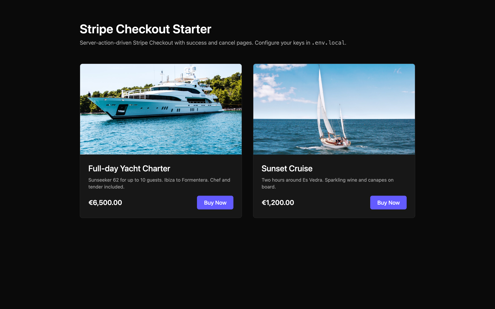

# Stripe Checkout Starter

Next.js 14 + Stripe Checkout, wired end-to-end with server actions, success and cancel pages. Working product example included. Clone, set two env vars, and take payments.



**Live demo:** [stripe-checkout-starter.vercel.app](https://stripe-checkout-starter.vercel.app)

## What's included

- **Next.js 14** App Router, TypeScript, Tailwind
- **Server actions** create the Stripe Checkout Session — no API route needed
- **Success page** retrieves the session and shows customer email
- **Cancel page** for graceful failure handling
- **2 sample products** with images to prove the flow end-to-end
- **Stripe SDK 17** with the 2024-11-20 API version

## Quick start

```bash
git clone https://github.com/nazirabas/stripe-checkout-starter my-shop
cd my-shop
npm install
cp .env.example .env.local
# fill in STRIPE_SECRET_KEY and NEXT_PUBLIC_STRIPE_PUBLISHABLE_KEY
npm run dev
```

Open http://localhost:3000, click **Buy Now**, complete the test payment with `4242 4242 4242 4242`.

## Environment variables

| Variable | Where to find |
|---|---|
| `STRIPE_SECRET_KEY` | Stripe Dashboard → Developers → API keys → Secret key |
| `NEXT_PUBLIC_STRIPE_PUBLISHABLE_KEY` | Same page → Publishable key |
| `NEXT_PUBLIC_SITE_URL` | `http://localhost:3000` for dev; your prod URL for deploy |

## Structure

```
src/app/
  page.tsx            # Product grid with Buy Now buttons
  actions.ts          # Server action: createCheckoutSession
  success/page.tsx    # Post-payment confirmation
  cancel/page.tsx     # Cancelled checkout
  layout.tsx
```

## How the server action works

Each Buy Now button is a `<form>` posting to a `"use server"` action. The action creates a Stripe Checkout Session with `mode: "payment"`, one line item built from the form data, and success/cancel URLs. Stripe returns a hosted URL and Next.js redirects to it. No client-side Stripe.js needed.

## Extending

- **Add products** — extend the `products` array in `page.tsx` or move it to `data/products.json`
- **Subscriptions** — change `mode: "payment"` to `mode: "subscription"` and use recurring prices
- **Webhooks** — add `src/app/api/webhook/route.ts` for post-payment fulfillment
- **Currencies** — swap `currency` per product; Stripe handles conversion display

## License

MIT.

---

Built by [Nazir Abbas](https://github.com/nazirabas). Web Developer and SEO Specialist for luxury brands.
